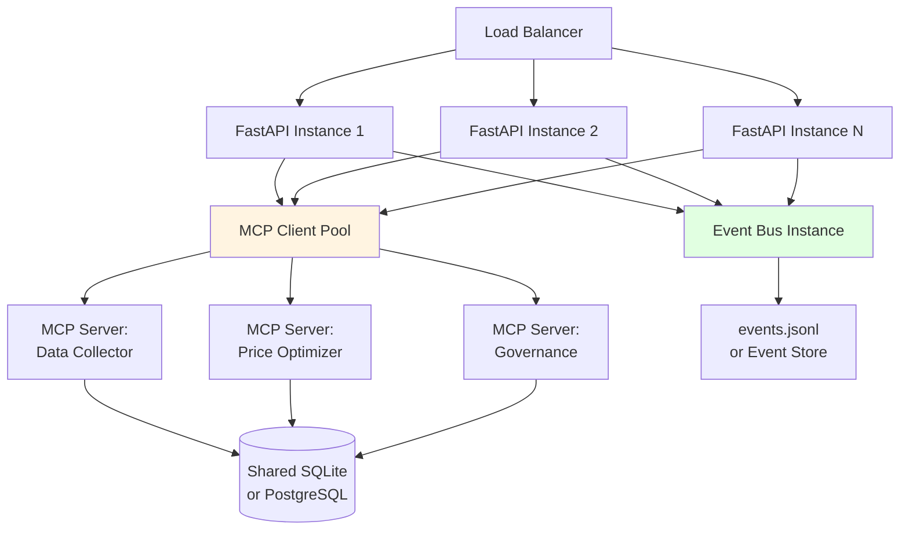

# Architectural Diagrams

This document contains Mermaid diagrams visualizing the system architecture.

## Table of Contents
1. [Event-Driven Agent Communication Flow](#event-driven-agent-communication-flow)
2. [LLM Tool Orchestration Workflow](#llm-tool-orchestration-workflow)
3. [SSE Streaming Architecture](#sse-streaming-architecture)
4. [Market Data Collection Flow](#market-data-collection-flow)
5. [Governance & Price Application](#governance--price-application)
6. [MCP Dual-Mode Architecture](#mcp-dual-mode-architecture)
7. [Component Interaction Overview](#component-interaction-overview)

---

## Event-Driven Agent Communication Flow


**Key Points**:
- All agents communicate through centralized Event Bus
- Event Journal logs every event to `events.jsonl` for audit trail
- Pub-sub pattern allows loose coupling between agents

---

## LLM Tool Orchestration Workflow


**Key Points**:
- Multi-provider failover with automatic retry
- Tool execution happens synchronously within streaming
- Up to `max_rounds` iterations for complex workflows
- Tracks token usage and costs per request

---

## SSE Streaming Architecture


**Key Points**:
- Single SSE connection carries multiple event types
- Frontend updates UI in real-time as events arrive
- Watchdog timer (25s) prevents hanging connections
- Draft threads auto-created on first message

---

## Market Data Collection Flow


**Key Points**:
- 3-event workflow: REQUEST → ACK → DONE
- Job tracking in database enables monitoring
- Supports multiple connectors (web scraper, mock, API)
- Duplicate prevention via instance-level set

---

## Governance & Price Application


**Key Points**:
- Dual-path governance: AutoApplier (fast) vs GovernanceExecutionAgent (enhanced)
- Guardrails: `min_margin`, `max_delta`, `auto_apply` toggle
- Optimistic concurrency prevents race conditions
- All decisions logged to immutable audit trail

---

## MCP Dual-Mode Architecture


**Key Points**:
- Single codebase supports both distributed (MCP) and local modes
- Factory functions abstract mode selection
- Connection pooling + retry logic for MCP resilience
- Auth capabilities for multi-tenant deployments

---

## Component Interaction Overview


**Key Points**:
- Clean separation: Frontend (UI) → Backend (API) → Core (Business Logic) → Data
- Event Bus enables agent coordination without tight coupling
- LLM Client provides AI capabilities to autonomous agents
- All events journaled for observability

---

## Technology Stack Diagram

```mermaid
graph LR
    subgraph Frontend Stack
        A[React 18] --> B[TypeScript 5]
        B --> C[Vite]
        C --> D[Tailwind CSS]
        D --> E[Radix UI]
        A --> F[Zustand]
        A --> G[TanStack Query]
        A --> H[Vitest/Playwright]
    end
    
    subgraph Backend Stack
        I[FastAPI] --> J[Python 3.11+]
        J --> K[SQLAlchemy]
        K --> L[SQLite]
        J --> M[Pydantic]
        J --> N[pytest]
    end
    
    subgraph AI/ML Stack
        O[OpenAI API] --> P[LLM Orchestration]
        Q[OpenRouter] --> P
        R[Google Gemini] --> P
        P --> S[Tool Calling]
        P --> T[Streaming]
    end
    
    subgraph Infrastructure
        U[Event Bus] --> V[Pub/Sub Pattern]
        W[MCP Protocol] --> X[Distributed Agents]
        Y[SSE] --> Z[Real-time Updates]
    end
    
    Frontend Stack -.->|HTTP/SSE| Backend Stack
    Backend Stack --> AI/ML Stack
    Backend Stack --> Infrastructure
    
    style Frontend Stack fill:#e1f5ff
    style Backend Stack fill:#fff4e1
    style AI/ML Stack fill:#e1ffe1
    style Infrastructure fill:#ffe1f5
```

---

## Deployment Architecture Options

### Development Mode (USE_MCP=false)


### Production Mode (USE_MCP=true)


**Key Points**:
- Development: All-in-one process for fast iteration
- Production: Distributed agents via MCP for scalability
- Shared event bus enables cross-instance coordination
- Database can scale from SQLite (dev) to PostgreSQL (prod)
